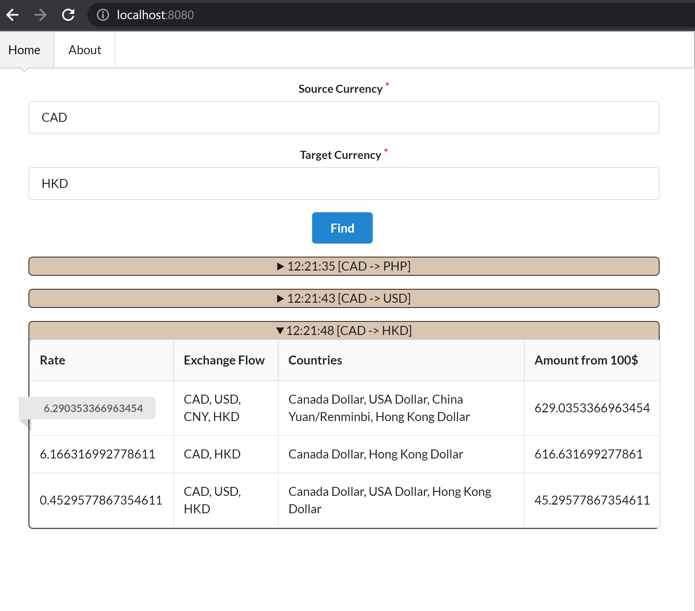

Currency exchange

By default CAD currency

Company looking to find the best currency conversion possible for our customers. 
However, we don’t have direct Canadian Dollar conversions to all currencies, 
so we have to trade currencies for other currencies. 
It is possible that we can go from one currency to another, 
and that a currency could show up multiple times.

Example

Convert CAD to EUR
CAD -> GBP -> EUR

There are no cycles
CAD -> GBP -> EUR -> GBP
Utilizing the API data, return the best possible conversion rate for every currency we can get, assuming we start with $100 CAD.

### Requirements

- Use a REST call to get the data, do not hardcode it into your source code.
- Generate a CSV file as an output with the following format:
  - Currency Code (ie. CAD, USD, BTC)
  - Country (ie. Canada, USA, Bitcoin)
  - Amount of currency, given we started with $100 CDN (ie. 4000.43)
  - Path for the best conversion rate, pipe delimited (ie. CAD | GBP | EUR)

### For start application

#### Prefer run application via docker-compose

 - via local node.js
   - copy .env.example to .env
   - update SEED to value provided from `api-coding-challenge.neofinancial.com`
   - install packages via `npm i`
   - execute command `npm run start`
   - send GET request to `http://localhost:3000/find-best-exchange?sourceKey=CAD&targetKey=PHP`
     - for start UI go to frontend folder `cd ./frontend`
     - install packages for frontend `npm i`
     - start react application `npm run start`

 - via docker
   - make sure you have installed docker
   - if you want to run only server
     - execute command for build `docker build -t neo-financial .`
     - run container `docker run -dp 3000:3000 -dp 4000:4000 neo-financial`
   - if you want to run server with UI
     - execute command `docker-compose up --build`
     - UI will run on http://localhost:8080 
     - API will work on http://localhost:3000

Best solution on first row (the highest rate).

